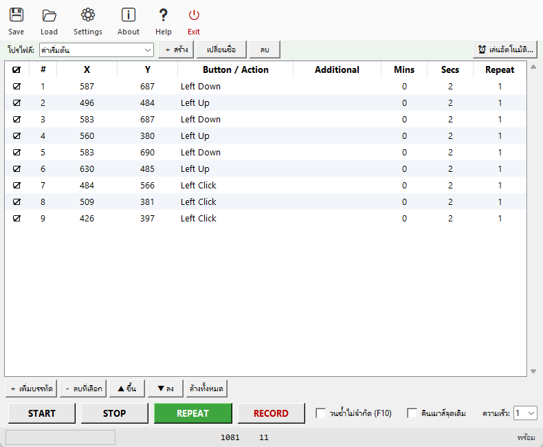
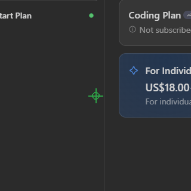

# 🖱️ Auto Mouse & Keyboard Macro v2.11.0

<div align="center">

# สั่งเมาส์ + คีย์บอร์ดทำงานแทนคุณแบบอัตโนมัติ

**อัดครั้งเดียว เล่นซ้ำได้ไม่จำกัด — ฟรี โอเพนซอร์ส ไม่มีโฆษณา ไม่มีล็อกอิน**

[](https://github.com/NarDecH/Python_Mouse_Keyboard_Macro/actions/workflows/tests.yml)


### ⬇️ ดาวน์โหลดเลย — ไม่ต้องติดตั้ง Python

[**📦 โหลด AutoMouseMacro.exe ล่าสุด (Windows)**](https://github.com/NarDecH/Python_Mouse_Keyboard_Macro/releases/latest)<br>
[เวอร์ชันทั้งหมด](https://github.com/NarDecH/Python_Mouse_Keyboard_Macro/releases) ·
[คู่มือฉบับสมบูรณ์](TUTORIAL.md) ·
[สคริปต์ตัวอย่าง](../examples/README.md) ·
[🇬🇧 English](README.en.md) ·
[🌐 หน้าแนะนำโปรแกรม (แชร์ได้)](LANDING.html) ·
[📣 โพสต์แนะนำสำเร็จรูป](ANNOUNCE.md)

</div>

---

## 🆚 เทียบกับโปรแกรมอื่น

| | **Auto Mouse & Keyboard Macro** | AutoHotkey | TinyTask |
|---|---|---|---|
| ราคา | ✅ ฟรี โอเพนซอร์ส | ฟรี | ฟรี |
| อัดการทำงาน (RECORD) | ✅ คลิก+คีย์+scroll พร้อมจับเวลาอัตโนมัติ | ✅ (ต้องเขียนสคริปต์) | ✅ |
| แก้สคริปต์ทีละแถวในตาราง | ✅ แก้/ลากสลับ/จับพิกัดในหน้าต่างเดียว | ❌ ต้องแก้โค้ด | ❌ |
| คลิกตามภาพ (Image Click) | ✅ + กรอบค้นหา + threshold รายแถว | ⚠️ ImageSearch | ❌ |
| ปุ่มลัดทำงานแม้ไม่โฟกัส | ✅ F1–F10 (self-healing) | ✅ | ⚠️ จำกัด |
| เงื่อนไขในสคริปต์ | ✅ If Image / Pixel Color / Variable / Loop / Time | ✅ (ต้องเขียนสคริปต์) | ❌ |
| ตัวแปร + คลิปบอร์ดในสคริปต์ | ✅ `{ชื่อ}` + Set/Read Clipboard | ✅ (ต้องเขียนสคริปต์) | ❌ |
| เล่นตามเวลา (schedule) | ✅ ทุก N นาที / รายวัน HH:MM + เลือกโปรไฟล์ | ⚠️ เขียนเอง | ❌ |
| สุ่มลำดับ/สัดส่วนแถว | ✅ shuffle + % | ⚠️ เขียนเอง | ❌ |
| ดีเลย์สุ่ม (กันจับ pattern) | ✅ `1-3` | ⚠️ เขียนเอง | ❌ |
| ปลั๊กอินขยาย Action | ✅ ไฟล์ Python เดียววางใน `plugins/` | ✅ | ❌ |
| รันแบบ CLI (Task Scheduler) | ✅ + watchdog + --validate + safety timeout | ✅ | ❌ |
| ไฟล์เดียวจบ ไม่ต้องติดตั้ง | ✅ .exe ไฟล์เดียว | ❌ | ✅ |
| log ตรวจสอบย้อนหลัง | ✅ รายวัน + สถิติ/กราฟในโปรแกรม | ❌ | ❌ |

> สรุป: อยากได้ **ง่ายแบบกดอัดแล้วเล่นซ้ำ** + **แก้ได้ละเอียดแบบสคริปต์** ในตัวเดียว — นี่คือจุดขายของโปรแกรมนี้

---

## 📸 หน้าตาโปรแกรมจริง

<div align="center">

<br><em>หน้าจอหลัก: เมนูไอคอน + แถบโปรไฟล์ + ตารางคำสั่ง + ปุ่มควบคุมทั้งหมด</em>
</div>

**🎬 การเล่นจริง (GIF จากโปรแกรม):**

<div align="center">

<br><em>เคอร์เซอร์ไล่ตามสคริปต์ (อัดจากการรันโปรแกรมจริง)</em>
</div>

**🎥 คลิปสอนกลุ่ม IMAGE (v2.4):** [docs/images/tutorial_image.mp4](images/tutorial_image.mp4) —
สอนครบทั้งขั้น: 📸 จับภาพ → Image Click + Search Area/Threshold → เล่นคลิกจริง →
If Image ทางแยก A/B → Wait for Image (สร้างด้วย `tools/make_image_tutorial.py`)

---

## ✨ ความสามารถ

| ฟีเจอร์ | รายละเอียด |
|---|---|
| 🔴 **RECORD** (F9) | บันทึกการคลิกเมาส์และการกดคีย์แบบเรียลไทม์ พร้อมจับเวลาหน่วงอัตโนมัติ |
| ▶️ **START** (F6) | เล่นสคริปต์ที่เปิดใช้ (☑) หนึ่งรอบ |
| 🔁 **REPEAT** | เล่นวนซ้ำต่อเนื่อง หรือติ๊ก "วนซ้ำไม่จำกัด" (F10) เพื่อวนตลอด |
| ⏹️ **STOP** (F8) | หยุดทุกอย่างทันที |
| ✅ **Checkbox รายแถว** | เลือกได้ว่าแถวไหนจะถูกเล่น แถวไหนข้าม |
| ✏️ **แก้ค่าในตาราง** | ดับเบิลคลิกช่องไหนก็ได้เพื่อแก้ Action / คีย์ / เวลา / Repeat |
| 🎯 **จับพิกัดเมาส์** | ดับเบิลคลิกช่อง X หรือ Y → นับถอยหลัง 3 วิ → จับตำแหน่งเมาส์ปัจจุบัน |
| 💾 **Save / Load** | เก็บสคริปต์เป็นไฟล์ `.json` เปิดกลับมาแก้ไขได้ + autosave ตอนปิดโปรแกรม |
| 🖥️ **Live statusbar** | แสดงพิกัดเมาส์และคีย์ที่กดล่าสุดแบบสด ๆ |
| 📦 **แพ็กเป็น .exe** | build.bat → ได้ไฟล์เดียว `dist/AutoMouseMacro.exe` ไม่ต้องติดตั้ง Python |
| 🌐 **Global Hotkey** | F6/F8/F9/F10 กดได้แม้โปรแกรมไม่ได้โฟกัส |
| ⚡ **Hot-profile** (F1–F4) | ตั้งโฟลเดอร์สคริปต์ แล้วกด F1–F4 เพื่อโหลดสคริปต์ลำดับที่ 1–4 แล้วเล่นทันที |
| 📜 **Log viewer** | เปิดดู log การเล่นย้อนหลังจากในโปรแกรม (เมนู 📝 Log) เลือกดูรายวันได้ |
| 🧙 **Record wizard** | อัด → ตรวจรายการ → ทดลองเล่น → บันทึก จบในหน้าต่างเดียว (เมนู 🧙 Wizard) |
| 🎲 **สุ่มลำดับ/สัดส่วน** | เล่นแถวแบบสลับลำดับสุ่ม และ/หรือเลือกเล่นแค่ x% ของแถว (สุ่มชุดใหม่ทุกรอบ) |
| 📊 **สถิติการเล่น** | สรุปจาก log ทุกวัน + กราฟรายวัน 14 วัน และยอดรวมรายเดือน 12 เดือนล่าสุด |
| 💾 **Export/Import การตั้งค่า** | ย้ายเครื่อง/สำรองทุกอย่าง (งาน+โปรไฟล์+ตั้งค่า) เป็นไฟล์เดียวจากเมนู Settings |
| 🗄️ **Backup อัตโนมัติ** | ปิดโปรแกรมทุกครั้งสำรองให้เองใน backups/ — เก็บ 1–90 วันตามที่ตั้ง (ค่าเริ่มต้น 7) |
| 🌐 **สลับภาษาได้** | ไทย / English เปลี่ยนได้ใน Settings ทันทีไม่ต้องรีเปิด |
| ❓ **Help ฉบับเต็ม** | คู่มือในโปรแกรมครอบทุกฟีเจอร์ + ปุ่มเปิด TUTORIAL จากในเมนู |
| 🩺 **Self-check ตอนเปิด** | ตรวจ pynput/OpenCV/global hotkey/สิทธิ์ admin แจ้งผลใน Settings ทันที |
| 🖼️ **คลิกตามภาพ** | ระบุไฟล์ .png → หาบนหน้าจอด้วย OpenCV แล้วคลิกให้เอง |
| 🎛️ **โปรไฟล์** | เก็บหลายสคริปต์สลับใช้ (งานบ้าน / เกม A / เกม B) |
| ⏰ **เล่นตามเวลา** | ตั้งเล่นอัตโนมัติ "ทุก N นาที" หรือ "ทุกวัน HH:MM" + เลือกโปรไฟล์ที่จะเล่น |
| 🛡️ **Safety timeout (v2.4)** | หยุดเองหลังเล่น N นาที (1–720) กันสคริปต์ลืมหยุด — ตั้งใน Settings หรือ CLI `--max-minutes` |
| 🔄 **Global hotkey self-healing (v2.4)** | listener ปุ่มลัดตายเงียบ ๆ ได้ → โปรแกรมรีสตาร์ตให้เอง + แจ้งใน statusbar |
| 🖱️ **ลากสลับแถว (v2.5)** | คลิกค้างแล้วลาก วางก่อน/หลังตามครึ่งแถว + autoscroll + ลากทั้งก้อนที่เลือก · เลือกหลายแถว Delete ทีเดียว (v2.4) · Alt+↑↓ |
| 🔁 **Undo/Redo (v2.5)** | Ctrl+Z / Ctrl+Y รวมการแก้เซลล์ด้วย + คอลัมน์ หมายเหตุ (Note) + ค้นหาแทนที่ทั้งหมด (Ctrl+F) |
| 🎨 **เงื่อนไขสี/ตัวแปร (v2.5)** | If Pixel Color · Read Pixel Color เก็บสีเป็น `{ตัวแปร}` · If Variable เทียบตัวเลข/ข้อความ · Image Click ตั้ง `{img_x}/{img_y}` · `rand 1-100` |
| 🔗 **เงื่อนไขรวม && (v2.6.0)** | ต่อเงื่อนไขด้วย `&&` — ทุกเงื่อนไขต้องจริงจึงเล่นต่อ เช่น `img.png && 300,300 #ffffff && n > 5` (ใช้กับ If Image/Pixel/Variable + `--validate` เข้าใจ) |
| 🧱 **Block Start/End (v2.6.0)** | บล็อกเงื่อนไข + ลูปย่อย: `if ...` ข้ามทั้งบล็อกเมื่อไม่จริง, `until ... max N` วนกลับจนจริง (ซ้อนได้ 8 ชั้น, `--validate` ตรวจคู่เปิด/ปิด) |
| 🕒 **Schedule รายเวลาเลือกโปรไฟล์ (v2.8.0)** | ทุกวันเวลาได้หลายเวลาคั่น comma และแต่ละเวลาระบุโปรไฟล์ได้ เช่น `08:00, 12:30=งานเช้า, 22:00` — ถึงเวลาโหลดโปรไฟล์นั้นมาเล่นเอง |
| 🔀 **ทำงานร่วม AutoHotkey (v2.7.0)** | เมนู 🔀: ส่งออกสคริปต์เป็น .ahk / นำเข้าไฟล์ .ahk (Send/Click/MouseMove/Sleep/Run) เข้าตาราง — push undo ให้เอง |
| 🔀 **.ahk ตัวแปรสองทิศ (v2.8.0)** | export `Set Variable` → `n := 5` / `If Variable` → `if (n > 5)` · import `n := 0` / `n += 2` / `if (n > 5)` กลับเป็นแถวได้ |
| 🔌 **plugin ชุมชน (v2.8.0)** | ตัวอย่างใหม่ Random Pause / Counter / Open URL + issue template สำหรับส่ง plugin เข้าโปรแกรม (เกณฑ์: docs/PLUGINS.md) |
| 🗜️ **ย่อ/ขยายกลุ่มบล็อก (v2.8.1)** | คลิกขวาที่ Block Start → ย่อแถวระหว่างคู่ Block End ได้ (กลไกเดียวกับ Section) — แถวซ่อนยังเล่น/บันทึกครบ กันซ้อนย่ออัตโนมัติ |
| 🔍 **ปุ่มตรวจสคริปต์ใน GUI (v2.8.1)** | เมนู 🔍 Validate — ตรวจทั้งสคริปต์ด้วย engine เดียวกับ --validate แล้วรายงาน "แถว N: เหตุผล" เป็นหน้าต่าง |
| 🚦 **START ตรวจก่อนเล่น (v2.9.0)** | กด START ตรวจด้วย validate_rows เดียวกับ 🔍 Validate — พบปัญหาถามยืนยัน ยืนยัน = เล่นเฉพาะแถวที่ผ่าน (แถวพังถูกข้ามจริง) ทุกแถวพัง = ไม่เล่น |
| 🗜️ **ย่อ/ขยายทั้งหมด (v2.9.0)** | เมนูขวา "ย่อทั้งหมด" ย่อ Section + บล็อกทุกตัวในครั้งเดียว / "ขยายทั้งหมด" คืนตารางเต็มลำดับเดิมเป๊ะ |
| 🔀 **.ahk บล็อกสองทิศ (v2.9.0)** | export Block Start → `if (…) {` / `Loop, N {` / `} Until,` · import กลับเป็นแถว Block Start/End — ภาพ/สีที่แปลไม่ได้เป็น comment ทั้งบล็อก ไม่มีปีกกาลลอย |
| 🧪 **Dry-run (v2.10)** | เมนู 🧪 / CLI `--dry-run` — ซ้อมเดินสคริปต์ครบทุกเส้นทาง (เงื่อนไข/บล็อก/ดีเลย์/ตัวแปร) โดยไม่แตะเมาส์/คีย์ — แถว input จริงถูกแทนด้วยข้อความรายงาน |
| 📝 **รายงาน Dry-run เป็นไฟล์ (v2.10.1)** | จบ dry-run เขียน `dry_report_วันที่.txt` สรุปเส้นทาง + นับรายการที่จะทำจริง — ถูกหยุดกลางคันก็บันทึกส่วนที่เดินผ่าน (GUI + CLI) |
| 🔗 **ผลเงื่อนไขเป็นตัวแปร (v2.10)** | โทเคน `>ชื่อ` ท้าย Additional ของเงื่อนไขทุกชนิด เก็บผล "1"/"0" — แถวถัดไปใช้ `{ชื่อ}` หรือ If Variable ต่อได้เลย |
| 📦 **Batch runner (v2.10)** | CLI `--queue LIST.txt` รันสคริปต์หลายไฟล์ต่อกัน — ตรวจทุกไฟล์ก่อนเริ่ม (พัง = ยกเลิกทั้งคิว) + สรุปรายไฟล์ + log [QUEUE] |
| 🗂️ **Queue Bat (v2.10.1)** | เมนู 🗂️ เลือกไฟล์ลิสต์คิว → ได้ .bat/.sh ข้างลิสต์ ดับเบิลคลิกเล่นคิวทั้งชุด ไม่ต้องพิมพ์คำสั่ง |
| 🗃️ **เครื่องมือ log (v2.11)** | เมนู 📝 เพิ่มปุ่มเก็บถาวรวันเก่า (ย้ายลง `log_archive/` รายเดือน) / ล้างวันเก่า + เห็นรายงาน dry-run · ตั้งจัดการอัตโนมัติตอนปิดโปรแกรมได้ใน Settings (เก็บย้อนหลัง 1–365 วัน) |
| 📤 **Export .bat/.sh (v2.3)** | สร้างไฟล์ดับเบิลคลิกรันข้างสคริปต์ (Windows/Linux/macOS) |
| 🔎 **--validate (v2.4)** | ตรวจสคริปต์ทุกแถวรายงานปัญหา ก่อนปล่อยงานค้างคืนจริง |

## 🧩 คำสั่งที่รองรับในตาราง

**เมาส์:** Left Click / Left Down / Left Up / Right Click / Right Down / Right Up / Middle Click / Middle Down / Middle Up / Double Left Click / Double Right Click / Ctrl+Click / Shift+Click / Alt+Click / Ctrl+Right Click / Scroll Up / Scroll Down (จำนวนจังหวะใน Additional) / Move Mouse / Move Mouse by Offset / Save Cursor / Restore Cursor

**คีย์บอร์ด:** Tap Key / Press Key / Release Key — ช่อง Additional ใส่ชื่อคีย์ได้ เช่น
`a` `5` `space` `enter` `esc` `ctrl` `shift` `alt` `win` `f1`–`f12` `up` `down` `left` `right` `pgup` `pgdn` `prtsc` หรือรหัส virtual key เช่น `27`

**Action เสริม (v1.5 ขึ้นไป):**
- **Type Text** — พิมพ์ข้อความ (รองรับไทย) เช่น `สวัสดี world`
- **Launch App** — เปิดโปรแกรม/เว็บ เช่น `notepad.exe` หรือ `https://example.com`
- **Image Click / Wait for Image** — คลิกตามภาพ / รอภาพปรากฏ (ชื่อไฟล์ .png ใน Additional; ต้องติดตั้ง `opencv-python Pillow`)
  - 🆕 **Search Area:** ใส่ท้ายชื่อไฟล์ได้ เช่น `button.png@100,200,300,400` = ค้นเฉพาะกรอบซ้ายบน (100,200) กว้าง 300 × สูง 400 — ไม่ใส่ @ = ค้นทั้งจอ
- **Beep** — เสียงเตือน
- **🔌 Custom Action (v1.16)** — เพิ่ม Action ของคุณเองด้วยไฟล์ Python สั้น ๆ ใน `plugins/` (ดู [plugins/README.md](../plugins/README.md))
- **🏪 ตลาด plugin (v2.1)** — [docs/PLUGINS.md](PLUGINS.md) รวม API/กฎ/แนวคิด + ปุ่ม **🔌 plugins** บนแถบเครื่องมือเปิดโฟลเดอร์ให้ทันที
- **🧩 engine แยกจาก GUI (v2.0–2.2)** — [macro_engine.py](../macro_engine.py) ไม่มี Tk นำไปฝังที่อื่นได้ · CLI ย่อย `py engine_cli.py script.json` สำหรับใช้ engine ล้วน (+ `--json-lines` อ่านสคริปต์ 1 แถว/บรรทัด)
- **🖱️ CLI ทำครบทุก action (v2.2)** — Image Click / If Image / Else / Wait for Image ทำงานใน CLI จริงแล้ว (เดิมเตือน "ยังไม่รองรับ") · กลไกบันทึก (Recorder) และค้นภาพอยู่ใน engine ล้วนทั้งหมด
- **🎵 plugin ใหม่ (v2.2)** — Play Sound (เสียงเตือนตามจำนวนครั้ง), Webhook (ยิง POST แจ้งเหตุการณ์), Multi Image Click (คลิกภาพหลายไฟล์ตามลำดับ)
- **🔀 If Image (v1.17)** — เงื่อนไข: ภาพ**ไม่เจอ** → ข้ามแถวถัดไป N แถว (N = ค่าในคอลัมน์ Repeat ของแถว If Image) ใช้ Search Area/threshold ร่วมกับ Image Click ได้
- **🔀 Else If Image (v1.18)** — เงื่อนไขสองทาง: If เจอ → เล่นกลุ่ม A แล้วข้ามกลุ่ม B, ไม่เจอ → เล่นกลุ่ม B
- **🎨 Wait for Pixel Color (v1.18)** — รอจนจุด (x,y) มีสีที่กำหนด (`300,300 #ffffff`) ก่อนทำงานต่อ
- **⏱ สถิติราย Action (v1.18)** — Stats แสดง Action ที่กินเวลารวมมากสุด 5 อันดับ หา bottleneck ได้ทันที
- **🔁 If Loop (v1.21)** — เงื่อนไขนับรอบ: Additional = เลขรอบ N เช่น `3` → รอบที่ 3 ขึ้นไปข้าม N แถวถัดไป (Repeat) — เหมาะกับ "รอบแรก setup รอบถัดไปข้าม"
- **🕐 If Time (v1.21)** — เงื่อนไขเวลา: Additional = `HH:MM` เช่น `22:30` → ผ่านเวลากำหนดแล้วข้าม N แถวถัดไป (Repeat)
- **🗂️ หัวข้อ Section (v1.21)** — คลิกขวา "เปลี่ยนเป็นหัวข้อ Section" = ป้ายชื่อกลุ่มแถว ไม่ถูกเล่น ไม่นับเลข — สคริปต์ยาวอ่านง่ายขึ้น
- **📁📂 ย่อ/ขยายกลุ่ม (v1.22)** — เมนูขวาบนหัวข้อ → ย่อกลุ่ม: แถวสมาชิกหายจากจอแต่**ถูกเล่นตามปกติ** กดซ้ำขยายคืนลำดับเดิม
- **🎨 สีแถวตามหมวด (v1.22)** — เงื่อนไข=สีเหลืองอ่อน · คีย์บอร์ด=สีม่วงอ่อน · Action พิเศษ=สีฟ้าอ่อน · แถวเมาส์=แถบสลับเดิม — แยกกลุ่มเห็นภาพทันที
- **🔍 Ctrl+F ค้นหาแถว** · **↩️ Ctrl+Z กู้คืนแถวที่ลบ** · **📋 เมนู Paste วางสคริปต์ JSON จากคลิปบอร์ด** (v1.17)

> 💡 **ดีเลย์สุ่ม:** ใส่ Secs แบบ `1-3` = สุ่มดีเลย์ 1–3 วิ ทุกรอบ

---

## 🚀 เริ่มใช้งานเร็ว ๆ

### วิธีที่ 1 — ใช้ไฟล์ .exe สำเร็จรูป (แนะนำ)

```bash
build.bat        # build ครั้งเดียว → dist\AutoMouseMacro.exe
```

จากนั้นดับเบิลคลิก `dist\AutoMouseMacro.exe` ได้เลย **ไม่ต้องติดตั้ง Python**

### วิธีที่ 2 — รันจากซอร์ส

```bash
py -m pip install -r requirements.txt    # ติดตั้ง pynput
run.bat                                  # หรือ: py auto_macro.py
```

> 💡 **ต้องมี Python 3.8+** (แนะนำ 3.12 ขึ้นไป) — โหลดที่ [python.org](https://www.python.org/downloads/)
> ถ้าเครื่องมีแค่ Windows Store stub ให้ใช้คำสั่ง `py` แทน `python`

### 🎬 ทดลองด้วยสคริปต์เดโม่ (มีให้ในโปรเจกต์)

| ไฟล์ | ทำอะไร |
|---|---|
| `examples/demo_script.json` | เปิด Notepad → พิมพ์ข้อความไทย → เคาะ Enter → บี๊บ → คืนเมาส์จุดเดิม (แสดงดีเลย์สุ่ม `0.5-1.5` และ Repeat ด้วย) |
| `examples/demo_move_click.json` | เลื่อนเมาส์เป็นสี่เหลี่ยม → ทดสอบ Scroll ขึ้น/ลง → บี๊บ → คืนเมาส์ (ไม่คลิกอะไรเลย ปลอดภัย) |

โหลดใน GUI: เมนู **Load** → เลือกไฟล์เดโม่ → กด **START**
หรือรันทันทีในคอนโซล:

```bash
py auto_macro.py examples/demo_script.json
```

> ทั้งสองไฟล์ **ไม่คลิกที่ใด** ทั้งสิ้น (ใช้แค่พิมพ์/เคาะคีย์/เลื่อนเมาส์/scroll) จึงไม่มีผลข้างเคียงกับเครื่อง

### 🧪 ทดลองใช้ครั้งแรกใน 60 วิ

1. กด **F9 (RECORD)** → สถานะเป็น "กำลังบันทึก"
2. คลิกที่ใดก็ได้บนจอ 2–3 จุด แล้วกด **F9** อีกครั้งเพื่อหยุด
3. กด **START (F6)** → เมาส์จะเล่นซ้ำทุกคลิกที่เพิ่งทำ
4. ลองกด **REPEAT** ให้วนตลอด แล้วหยุดด้วย **F8**

---

## 📖 คู่มือการใช้งาน

### ทำความรู้จักตาราง

| คอลัมน์ | ความหมาย |
|---|---|
| ☑ | เปิด/ปิดการใช้แถวนี้ (คลิกเพื่อสลับ) |
| # | ลำดับแถว |
| X, Y | พิกัดจุดที่จะย้ายเมาส์ไปก่อนคลิก |
| Button / Action | คำสั่ง: คลิกเมาส์ หรือ กดคีย์ |
| Additional | ชื่อคีย์ (เฉพาะคำสั่งคีย์บอร์ด) |
| Mins / Secs | เวลารอ **ก่อน** ทำคำสั่งในแถวนั้น |
| Repeat | จำนวนครั้งที่ทำคำสั่งนี้ซ้ำในแถวเดียว |

### การแก้ไขตาราง

- **ดับเบิลคลิกช่อง X / Y** → นับถอยหลัง 3 วิ แล้วจับพิกัดเมาส์ปัจจุบันให้อัตโนมัติ
- **ดับเบิลคลิกช่องอื่น** → เปิดหน้าต่างแก้ค่า (Action เป็น dropdown, ช่องเวลาพิมพ์ได้)
- **คลิกขวาบนแถว:** คัดลอกแถวนี้ / แทรกแถวใหม่ด้านบน-ด้านล่าง / ลบแถว
- **ปุ่มเสริม:** ＋ เพิ่มบรรทัด / － ลบที่เลือก / ▲▼ เลื่อนลำดับ / ล้างทั้งหมด / ปุ่ม Delete บนคีย์บอร์ด

### โปรไฟล์ และ เล่นอัตโนมัติตามเวลา

- **แถบ "โปรไฟล์"** ใต้เมนู — เก็บสคริปต์ได้หลายชุด สลับใช้ได้ทันที
  (ตัวอย่าง: "งานบ้าน", "เกม A", "เกม B") เก็บใน `macro_profiles.json`
- **ปุ่ม "⏰ เล่นอัตโนมัติ..."** — ตั้งให้เล่นโปรไฟล์ปัจจุบัน
  - ทุก N นาที (เช่น ทุก 10 นาที)
  - ทุกวัน เวลา HH:MM (เช่น 09:30)
  - การเล่นจะวนซ้ำ 1 รอบจบ และหยุดได้ด้วย F8 ตามปกติ

### ตัวเลือกการเล่น (แถบปุ่มด้านล่าง)

| ตัวเลือก | ความหมาย |
|---|---|
| **วนซ้ำไม่จำกัด** (F10) | เล่นต่อเนื่องไม่สิ้นสุด |
| **คืนเมาส์จุดเดิม** | จบรอบแล้วย้ายเมาส์กลับตำแหน่งที่เริ่มเล่น |
| **ความเร็ว** | ตัวคูณดีเลย์ทั้งหมด: 0.25× / 0.5× / 1× / 2× / 4× |
| **รอบ** | จำนวนรอบของสคริปต์ทั้งชุด — 0 = ไม่จำกัด |

### คีย์ลัดทั้งหมด (Global — กดได้แม้ไม่โฟกัสหน้าต่าง)

| คีย์ | ทำอะไร |
|---|---|
| **F6** | เริ่มเล่นสคริปต์ |
| **F8** | หยุดทั้งหมด |
| **F9** | เริ่ม/หยุดบันทึก |
| **F10** | สลับวนซ้ำไม่จำกัด |
| **Delete** | ลบแถวที่เลือก (เมื่อโฟกัสตาราง — Ctrl+Z กู้คืนได้) |
| **Ctrl+F** | ค้นหาแถว (พิมพ์ข้อความ → Enter เด้งผลถัดไป) |
| **Ctrl+Z** | กู้คืนแถวที่ลบ/ถูกแทนที่ล่าสุด |
| **Double-click** | แก้ค่าในเซลล์ |

> ⚠️ ถ้าโปรแกรมอื่นใช้คีย์ F6–F10 อยู่ global hotkey อาจถูกแทนที่ —
> ดูสถานะได้ที่เมนู Settings (กรณีนี้คีย์จะทำงานเมื่อโฟกัสหน้าต่างโปรแกรมเท่านั้น)

---

## ⚙️ การแจกจ่าย / Build เอง

```bash
build.bat                                # หรือแบบชัดเจน:
py -m PyInstaller auto_macro.spec --noconfirm --clean
```

ผลลัพธ์: `dist/AutoMouseMacro.exe` (ไฟล์เดียว ~13 MB, GUI ไม่มี console)

---

## 📁 โครงสร้างโปรเจกต์

```
├── auto_macro.py        # โปรแกรมหลัก (GUI + engine ฝังในบล็อกเดียว) — build .exe จากไฟล์นี้เสมอ
├── macro_engine.py      # engine ล้วน ไม่มี Tk (แหล่งจริงของบล็อก engine — แก้ที่นี่แล้วรัน build_singlefile.py ซิงก์)
├── engine_cli.py        # CLI ย่อย ใช้ engine ล้วนไม่แตะ tkinter
├── build_singlefile.py  # รวม macro_engine.py กลับเป็น auto_macro.py ก่อน build .exe
├── test_auto_macro.py   # unit tests (unittest)
├── test_e2e.py          # E2E tests — รัน CLI จริงเป็น subprocess
├── auto_macro.spec      # ไฟล์ spec ของ PyInstaller
├── build.bat / run.bat  # สคริปต์ build .exe / รันจากซอร์ส
├── requirements.txt     # pynput + opencv-python + Pillow
├── plugins/             # Custom Action plugins (ตลาด plugin)
├── examples/            # สคริปต์ตัวอย่าง 10+ ไฟล์
└── docs/                # เอกสารทั้งหมด (md + html)
```

## 🔄 CI/CD อัตโนมัติ

- **Tests** — ทุกครั้งที่ push/PR ระบบจะรัน unit tests บน Python 3.12–3.14 (Windows)
  ดูสถานะได้ที่แท็บ [Actions](https://github.com/NarDecH/Python_Mouse_Keyboard_Macro/actions)
- **Release** — สร้าง .exe และแนบให้โหลดอัตโนมัติเมื่อ push tag:

```bash
git tag v1.7 && git push origin v1.7
```

## ⌨️ เล่นผ่าน Command Line (ไม่เปิด GUI)

```bash
py auto_macro.py script.json                  # เล่นรอบเดียว
py auto_macro.py script.json --loop           # วนไม่จำกัด
py auto_macro.py script.json --loops 5        # 5 รอบ
py auto_macro.py script.json --speed 2        # เร็วขึ้น 2 เท่า
py auto_macro.py script.json --no-log         # ไม่บันทึก log
py auto_macro.py script.json --shuffle        # สุ่มลำดับแถวทุกรอบ
py auto_macro.py script.json --rows-pct 50    # เล่นแค่ 50% ของแถว (สุ่มชุดใหม่ทุกรอบ)
py auto_macro.py script.json --watchdog       # จบแล้วเริ่มใหม่อัตโนมัติ (พัก 3 วิ)
py auto_macro.py script.json --watchdog 10    # แบบกำหนดเวลาพักเอง
py auto_macro.py script.json --stop-file D:\stop.flg   # สร้างไฟล์นี้เมื่อไร = หยุดทันที
py auto_macro.py script.json --max-minutes 60 # safety timeout: หยุดเองหลังเล่น 60 นาที
py auto_macro.py script.json --validate       # ตรวจสคริปต์อย่างเดียวไม่เล่น (exit 1 เมื่อพบแถวมีปัญหา)
py auto_macro.py --version                    # แสดงเวอร์ชัน
py engine_cli.py script.json                  # CLI ย่อย engine ล้วน (ไม่แตะ tkinter)
```

> 💡 สคริปต์ที่มีแถว **Custom Action plugin** เล่นผ่าน CLI ได้เหมือนกัน — หัวโปรแกรมจะบอกรายชื่อ plugin ที่โหลดได้

> 💡 **watchdog** เหมาะกับงานเฝ้าระบบ: สคริปต์จบ → พัก N วิ → เริ่มใหม่เองวนไม่จำกัด
> ทุกการรีสตาร์ตบันทึก `[WATCHDOG]` ลง log — หยุดถาวรด้วย F8/Esc/Ctrl+C/stop-file

## 🔌 Custom Action Plugins (v1.16)

ขยายโปรแกรมโดยไม่ต้องแก้โค้ดหลัก — เขียนไฟล์ Python ใส่โฟลเดอร์ `plugins/` โปรแกรมโหลดให้อัตโนมัติ (ทั้ง GUI และ CLI):

```python
# plugins/my_action.py
ACTION_NAME = "เปิด Notepad แล้วรอ"     # ชื่อที่โชว์ในคอลัมน์ Action

def run(ctx, row):
    import os, time
    os.startfile("notepad.exe")
    time.sleep(1.5)
```

- `ctx` มี `mouse`/`kb` (pynput), `log(ข้อความ)`, `cfg` (ภาษา), `stop_check()` (คืน False เมื่อกด STOP),
  `ui` (`msg`/`beep`), `vars` (ชี้ dict ตัวแปรของสคริปต์ — เขียนค่าได้แถวถัดไปใช้ต่อ) — API ครบที่ [docs/PLUGINS.md](PLUGINS.md)
- `row` = ค่าทั้งแถวจากตาราง (`additional`, `secs`, ... )
- ไฟล์พัง → ข้ามไฟล์นั้น โปรแกรมไม่พัง · ไฟล์ขึ้นต้น `_` ไม่ถูกโหลด
- ตัวอย่างในโปรเจกต์: `Sleep (plugin)`, `Message Box` — รายละเอียดครบที่ [plugins/README.md](../plugins/README.md)

## 🧙 Record Wizard

เมนู **🧙 Wizard** — ครบจบในหน้าต่างเดียว เห็นรายการสดขณะอัด:

**● เริ่มอัด** → ทำตามที่ต้องการ → **■ หยุดอัด** → ตรวจรายการในตาราง →
**▶ ทดลองเล่น** (หยุดด้วย F8 ได้ทุกที่) → **💾 บันทึกไฟล์** (ตั้งชื่ออัตโนมัติ
แบบ `wizard_วันที่_เวลา.json`)

## 🎲 เล่นแบบสุ่ม (v1.10)

แถบปุ่มด้านล่างมีตัวเลือกใหม่:
- **สุ่มลำดับ** — ทุกรอบเล่นแถวเดิมแต่สลับลำดับสุ่มใหม่
- **สัดส่วนแถว %** — สุ่มเลือกเล่นเฉพาะบางส่วน เช่น 50% = สุ่ม 1 ใน 2 ของแถวทั้งหมด (ชุดใหม่ทุกรอบ)
- ใช้ร่วมกันได้ + ใช้ผ่าน CLI ด้วย `--shuffle` และ `--rows-pct` — เหมาะกับงานที่ต้องการ
  ให้จังหวะการทำงานไม่ซ้ำเดิมทุกรอบ

หยุดได้ทุกที่: กด **F8**/**Esc** (แม้ไม่โฟกัสหน้าต่าง), **Esc** หรือ **q** ในหน้าต่าง CLI,
หรือ **Ctrl+C** — เหมาะกับการรันผ่าน Windows Task Scheduler

## 📝 Log การเล่น

ทุกครั้งที่เล่น โปรแกรมบันทึกลง `macro_log_วันที่.txt` (หมุนรายวัน เก็บไม่เกิน 500 บรรทัด/ไฟล์):

```
08:57:05 [START] เริ่มเล่น (CLI) ความเร็ว 1x รอบ=1 แถวที่เล่น=3  <- test.json
08:57:05 [STEP] รอบ 1 แถว 1/3 Press Key ctrl (0.0 วิ)  <- test.json
08:57:08 [STOP] หยุดโดยผู้ใช้ (F8/Esc/Ctrl+C)  <- test.json
```

- **GUI:** เปิด/ปิดได้ในเมนู **Settings** (จำค่าไว้อัตโนมัติ)
- **ดูย้อนหลัง:** เมนู **📝 Log** เปิดหน้าต่าง Log viewer เลือกดูไฟล์รายวันได้ทันที
- **CLI:** ปิดด้วย `--no-log`
- ใช้ตรวจสอบย้อนหลังว่าสคริปต์ทำอะไรไปบ้าง แต่ละแถวใช้เวลาเท่าไร และถูกหยุดตอนไหน

## ⚡ Hot-profile (F1–F4)

งานที่ต้องสลับสคริปต์บ่อย ๆ ไม่ต้องเปิดหน้าต่าง Load ทุกครั้ง:

1. เมนู **⚡ Hot-profile** → เลือกโฟลเดอร์ที่เก็บสคริปต์ .json (จำค่าไว้อัตโนมัติ)
2. โปรแกรมเรียงไฟล์ .json ในโฟลเดอร์ตามชื่อ → ตำแหน่ง 1–4 คือ F1–F4
3. กด **F1** ถึง **F4** (กดได้แม้โปรแกรมไม่ได้โฟกัส) = โหลดสคริปต์นั้นแล้ว**เล่นทันที**
4. หยุดด้วย F8 ตามปกติ

เช่น โฟลเดอร์มี `a.json`, `b.json`, `c.json` → F1=a, F2=b, F3=c

## 🧪 ทดสอบ

```bash
py -m unittest test_auto_macro -v    # 370+ unit tests (รวมเปิด dialog จริง + เล่นจริง)
py -m unittest test_e2e -v           # 15 E2E tests (รัน CLI จริง + โค้ดจริงทุกสาย)
```

## 🤝 ร่วมพัฒนา

ยินดีรับ PR! อ่าน [CONTRIBUTING.md](../CONTRIBUTING.md) ก่อน — มีเกณฑ์ทดสอบและกติกาครบ

## 📂 ชุดตัวอย่างสคริปต์ (examples/)

นอกจากสคริปต์เดโม่ 2 ไฟล์ด้านบน ยังมีตัวอย่างเพิ่มใน [examples/](../examples/README.md):

| ไฟล์ | สอนอะไร |
|---|---|
| `01_auto_typer.json` | พิมพ์อัตโนมัติไทย/อังกฤษ + ดีเลย์สุ่ม + Repeat |
| `02_form_filler.json` | กรอกฟอร์ม (ชื่อ/อีเมล/โทร) ด้วยการพิมพ์ + Enter |
| `03_image_click.json` | Image Click + **Search Area** (`target.png@100,100,500,400`) — แถวคลิกปิด enabled ไว้ |
| `04_scroll_gallery.json` | Scroll ดูรูป/เว็บ + Move Mouse (แถวดับเบิลคลิกปิดไว้) |
| `05_watchdog_monitor.json` | งานเฝ้าระบบ ใช้กับ `--watchdog` |
| `06_plugin_demo.json` | Custom Action plugins (Message Box + Sleep) |
| `07_conditions.json` | เงื่อนไข: If Image กลุ่ม A/B + Wait for Pixel Color — ไม่คลิก ปลอดภัย |
| `08_variables.json` | ตัวแปร `{ชื่อ}` + Set Variable |
| `09_clipboard.json` | Set/Read Clipboard + ตัวแปร |
| `10_conditions_v21.json` | If Loop / If Time + หัวข้อ Section |
| `11_and_conditions.json` | เงื่อนไขรวม AND (`&&`) — ผสมภาพ+สีจุด+ตัวแปร+รอบ+เวลา |

ทุกตัวอย่าง validate กับโค้ดจริงแล้ว และเริ่ม/จบด้วย Save/Restore Cursor เสมอ

## 📚 เอกสารเพิ่มเติม

- **[TUTORIAL](TUTORIAL.html)** — 📘 คู่มือฉบับสมบูรณ์ 12 บท (ติดตั้ง → อัด → แก้ → Image Click → เงื่อนไข/ตัวแปร → FAQ)
- **[RESEARCH](RESEARCH.html)** — เทคนิคการควบคุมเมาส์/คีย์บอร์ดด้วย pynput, threading, และการเลือกเครื่องมือ
- **[PLUGINS](PLUGINS.md)** — 🔌 ตลาด plugin: API, กฎ, วิธีเขียน Custom Action ใน 30 วินาที
- **[CHANGELOG](CHANGELOG.html)** — ประวัติการเปลี่ยนแปลงทุกเวอร์ชัน
- **[ROADMAP](ROADMAP.md)** — 🗺️ แผนพัฒนาต่อ + หลักการที่ห้ามฝ่าฝืน
- **[ANNOUNCE](ANNOUNCE.md)** — 📣 โพสต์แนะนำโปรแกรมสำเร็จรูปสำหรับโซเชียล
- **[README.en](README.en.md)** — 🇬🇧 สรุปภาษาอังกฤษ

---

## ℹ️ เกี่ยวกับ (About)

**Auto Mouse & Keyboard Macro** — โปรแกรมอัตโนมัติสำหรับเมาส์และคีย์บอร์ด ฟรีและโอเพนซอร์ส
สำหรับ Windows (รองรับ Linux/macOS ผ่านไลบรารีเดียวกัน) พัฒนาด้วย Python + Tkinter + pynput ล้วน

- **ไม่มีโฆษณา ไม่มีล็อกอิน ไม่มีการเก็บข้อมูลผู้ใช้** — สคริปต์ทุกอย่างอยู่ในเครื่องคุณเท่านั้น (ไฟล์ .json อ่าน/แก้ได้)
- **ใช้งานง่ายระดับกดปุ่ม** — อัดแล้วเล่นซ้ำโดยไม่ต้องเขียนโค้ด แต่แก้ละเอียดระดับแถวได้ในตารางเดียว
- **ความปลอดภัยมาก่อน** — ปุ่ม STOP ใช้ได้ทุกช่องทาง + safety timeout + backup อัตโนมัติทุกครั้งที่ปิดโปรแกรม
- **โปร่งใส ตรวจสอบได้** — โอเพนซอร์สทั้งหมด, log การเล่นรายวัน, CI รันเทสต์ 370+15 ตัวทุก push
- **ไม่ผูกขาดผู้ใช้** — ไม่มี dependency หนัก, ขยายความสามารถด้วย plugin ได้เอง

⚠️ ใช้เพื่องานที่ชอบด้วย/อนุญาตเท่านั้น — อย่าใช้กับเกมหรือระบบที่ห้ามการทำงานอัตโนมัติ

ดาวน์โหลด: [Releases](https://github.com/NarDecH/Python_Mouse_Keyboard_Macro/releases/latest) ·
รายงานบั๊ก/เสนอฟีเจอร์: [Issues](https://github.com/NarDecH/Python_Mouse_Keyboard_Macro/issues)

---

<div align="center">
<sub>สร้างด้วย Python + Tkinter + pynput • ทำงานบน Windows (รองรับ Linux/macOS)</sub>
</div>
