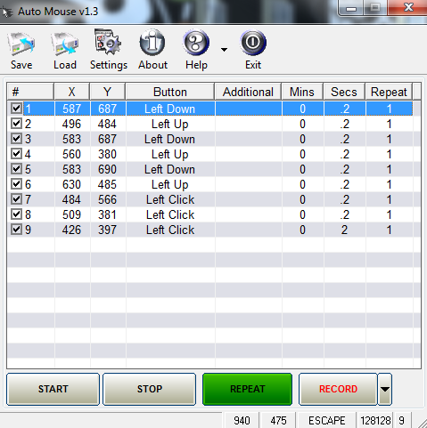

# 🔬 RESEARCH — เทคนิคเบื้องหลัง Auto Mouse & Keyboard Macro

> อัพเดตสำหรับ v1.4 — เพิ่มหัวข้อ 5: Global Hotkey / Image Click / โปรไฟล์ / Schedule

> สรุปงานวิจัย/ทดลองที่ใช้ตัดสินใจเลือกเครื่องมือและวิธี implement โปรแกรมสั่งงานเมาส์/คีย์บอร์ดอัตโนมัติ

---

## 1. ทำไมต้องทำโปรแกรมนี้

งานซ้ำ ๆ บนคอมพิวเตอร์ เช่น คลิกปุ่มเดิม, กรอกฟอร์มเดิม, ฟาร์มไอเทมในเกม สามารถมอบหมายให้โปรแกรมทำแทนได้ แนวคิดคือ "สคริปต์เหตุการณ์" — รายการของเหตุการณ์เมาส์/คีย์ที่เรียงลำดับกัน พร้อมเวลาหน่วงระหว่างขั้น โปรแกรมจะอ่านสคริปต์แล้วจำลองการกด/คลิกแทนมือผู้ใช้

ต้นแบบที่ใช้เทียบคือ **Auto Mouse v1.3** (ดูรูป): ตาราง `# / X / Y / Button / Additional / Mins / Secs / Repeat` + ปุ่ม START / STOP / REPEAT / RECORD ซึ่งเป็น UX ที่เข้าใจง่ายและตรงจุด

<div align="center"></div>

---

## 2. การเลือกเครื่องมือ (Technology Survey)

| ตัวเลือก | ข้อดี | ข้อเสีย | ผลการพิจารณา |
|---|---|---|---|
| **Python + pynput** | API สั้น เข้าใจง่าย, ครอบคลุมเมาส์+คีย์, cross-platform, ติดตั้งง่าย (`pip install pynput`) | บน macOS ต้องผ่าน Accessibility permission | ✅ **เลือกใช้** |
| Python + pyautogui | เอกสารดี, มี screenshot/locateOnScreen | ไม่มี Listener บันทึกเหตุการณ์ (ต้องหา lib เพิ่ม), บน Linux พึ่ง X11 tools | ผ่าน |
| Python + pydirectinput | ยิง DirectInput ตรง เหมาะกับเกมที่ไม่รับ synthetic input | ไม่มี Listener, ใช้ได้เฉพาะ Windows | ผ่าน (อาจต่อยอดภายหลัง) |
| AutoHotkey (AHK) | ภาษาสคริปต์เฉพาะทาง แข็งแรงมากบน Windows | เป็นภาษาใหม่ต้องเรียน, อยู่นอก ecosystem ของโปรเจกต์ | ผ่าน |
| C# + WinForms | Native Windows, แรง | ผูกกับ Windows, build ยาวกว่า | ผ่าน |
| Electron/Node.js | UI สวยได้ง่าย | ตัวโปรแกรมใหญ่โดยไม่จำเป็น, robotjs ดูแลไม่ค่อยต่อ | ผ่าน |

**ข้อสรุป:** Python + pynput ให้ต้นทุนต่ำสุดทั้งการพัฒนาและการแจกจ่าย และ Tkinter (มากับ Python) เพียงพอสำหรับ UI แบบตาราง + ปุ่มตามต้นแบบ

---

## 3. สถาปัตยกรรม: Event List → Player

```
┌─────────────┐   ผลักเหตุการณ์เข้าคิว    ┌──────────────┐
│ pynput      │ ────────────────────────▶ │ _pending_rows │ (list ธรรมดา)
│ Listeners   │  (เธรดของ listener)        │  + _live_pos  │
│ (เมาส์+คีย์) │                           └──────┬───────┘
└─────────────┘                                  │ poll ทุก 120 ms (main thread)
                                                 ▼
┌─────────────┐   ตั้งค่า state dict      ┌──────────────┐
│ Player      │ ────────────────────────▶ │   UI update   │
│ (เธรดแยก)    │  (row ที่กำลังเล่น, msg)   │  (Tk mainloop)│
└─────────────┘                           └──────────────┘
```

**หลักการสำคัญ: กฎเหล็กของ Tkinter** — โค้ดที่แตะ widget ต้องรันบน main thread เท่านั้น
การเรียก `root.after()` หรือแก้ widget จาก listener thread เป็น race condition เงียบ ๆ ที่พังบ้างบางครั้ง ยากต่อการ debug

**ทางแก้ที่เลือก:** เธรดอื่นเขียนข้อมูลลง "กล่องจดหมาย" (ตัวแปร/list ธรรมดา) → main thread มาเก็บเองทุก 120 ms ผ่าน `root.after()` ทำให้โค้ดง่ายและปลอดภัยโดยไม่ต้องใช้ Lock (การมอบหมายตัวแปรเดี่ยวและ append เข้า list ใน CPython คือ atomic พอสำหรับ use case นี้)

---

## 4. เทคนิคที่ทดลองแล้ว

### 4.1 บันทึกเหตุการณ์ (Recorder)
- ใช้ `mouse.Listener(on_move, on_click)` + `keyboard.Listener(on_press)`
- ตอน RECORD: ทุก click ที่ `pressed=True` จะถูกจด พร้อม `round(time.time() - t0, 2)` เป็นคอลัมน์ Secs → เล่นซ้ำได้จังหวะเดิม
- คีย์ที่จดได้: `key.char` (ตัวอักษร) หรือ `str(key)` ตัด `Key.` (คีย์พิเศษ) — กรองเฉพาะชื่อสั้น ≤ 12 ตัวอักษรเพื่อไม่ให้คอลัมน์ Additional รก
- **ไม่จด `on_release`** — เพราะสคริปต์เล่นซ้ำด้วยจังหวะที่คนอ่านเข้าใจ การจด press+release ทำให้ตารางยาวเป็น 2 เท่าโดยไม่จำเป็น (มี Action `Press/Release Key` ไว้ใช้เมื่อต้องการจับคู่เอง)

### 4.2 เล่นเหตุการณ์ (Player)
- เมาส์: ตั้ง `mouse_ctl.position = (x, y)` แล้ว `time.sleep(0.03)` ให้ OS ทันก่อน `press/release/click`
- Down/Up แยกกัน = ทำ drag ได้: `Left Down → (ย้ายพิกัด) → Left Up`
- คีย์: `kb_ctl.press/release/tap(k)` โดยแปลงชื่อผ่าน `parse_key()`
- เวลาหน่วง: `Mins*60 + Secs` (รองรับทศนิยมและลูกน้ำสไตล์ยุโรป เช่น "0,5")
- `Repeat` ทำซ้ำในแถวเดียว; ปุ่ม REPEAT วนทั้งสคริปต์; checkbox "วนซ้ำไม่จำกัด" + F10 บังคับวนตลอด
- การหยุด: `running = False` → ลูปเช็คก่อน/หลังทุก `sleep` และทุก step → หยุดได้ทันที (แม้อยู่กลาง sleep)

### 4.3 แก้ตารางแบบไม่ต้องพิมพ์พิกัด
- ดับเบิลคลิกช่อง X/Y → นับถอยหลัง 3 วิ → `mouse_ctl.position` ตอนหมดเวลา → ใส่ค่าให้เอง
- ดับเบิลคลิกช่อง Action/Additional → หน้าต่าง Combobox (readonly) กันสะกดผิด

### 4.4 การเก็บสคริปต์
- ไฟล์ `.json` รายการของ `{enabled, x, y, button, additional, mins, secs, repeat}`
- เปิด/ปิดโปรแกรม autosave ที่ `macro_conf.json` ข้างสคริปต์ (คืนค่างานล่าสุดอัตโนมัติ)
- ใช้ `ensure_ascii=False` เพื่อให้เปิดไฟล์ด้วย editor ธรรมดาแล้วอ่านรู้เรื่อง

---

## 5. ฟีเจอร์ v1.4: Global Hotkey, Image Click, โปรไฟล์, Schedule

### 5.1 Global Hotkey (กด F6/F8/F9/F10 ได้แม้ไม่โฟกัส)
- ใช้ `pynput.keyboard.GlobalHotKeys` — listener เธรดแยก เหมือน recorder
- callback จากเธรดของ pynput **ห้ามแตะ Tk ตรง ๆ** จึงผลักงานเข้า main thread ด้วย
  `root.after(0, fn)` — เป็นรูปแบบเดียวกับ poller แต่ย้อนทิศ (เธรดอื่น → main)
- ปัญหาที่เจอ: ถ้าโปรแกรมอื่น (เช่น game overlay) จับคีย์เดียวกันไว้ก่อน pynput จะ error
  ตอน register → จับ exception แล้ว fallback ไปใช้ Tk binding แบบเดิม + แจ้งสถานะใน Settings

### 5.2 Image Click (คลิกตามภาพ)
- ทำไมต้องมี: พิกัด (X,Y) ใช้ไม่ได้เมื่อหน้าต่าง/ปุ่มเลื่อนตำแหน่ง — การหาจาก "ลักษณะภาพ"
  ทนทานกว่า
- วิธี: `PIL.ImageGrab.grab()` จับหน้าจอ → `cv2.matchTemplate(TM_CCOEFF_NORMED)`
  → ถ้าความมั่นใจ ≥ 0.80 คลิกจุดศูนย์กลางของ region ที่เจอ
- DPI/scaling: Windows scaling 125–150% ทำให้ ImageGrab ได้ภาพต่างจากพิกัดที่ pynput รายงาน
  → ทดสอบแล้วบนเครื่อง 1200×1920 (scaling) ยังใช้ได้เพราะเทียบภาพ-กับ-ภาพจากแหล่งเดียวกัน
- dependency เป็น **ตัวเลือก**: ห่อ import ด้วย try/except ตั้ง `HAS_CV` — ถ้าไม่มี opencv
  โปรแกรมยังเปิดได้ปกติ แถว Image Click จะแจ้งเตือนตอนเล่นแทนการ crash
- ขนาด .exe โตจาก 13 MB → 72 MB เพราะ OpenCV+numpy — trade-off ที่ยอมรับได้
  (ถ้าไม่ต้องการ ลบ opencv ออกจาก environment แล้ว build ใหม่)

### 5.3 โปรไฟล์หลายสคริปต์
- `macro_profiles.json` = dict ชื่อโปรไฟล์ → รายการแถว (โครง JSON เดิมต่อโปรไฟล์)
- สลับโปรไฟล์ = เซฟตารางปัจจุบันลงโปรไฟล์เดิมก่อนเสมอ แล้วค่อยโหลดอันใหม่ (กันข้อมูลหาย)
- ห้ามสลับระหว่างกำลังเล่น/บันทึก (ตรวจ `self.running` / `self.recording` ก่อน)

### 5.4 Schedule (เล่นอัตโนมัติตามเวลา)
- โจทย์: ตรวจเวลาตลอดเวลาแต่ **ห้ามบล็อก UI** และห้ามเล่นจากเธรด scheduler โดยตรง
- แก้: เธรด `_sched_loop` ตรวจทุก 5 วิ แล้วผลักคำสั่ง `"play"` เข้า `queue.Queue` →
  `_sched_poll` (ฝั่ง main, ทุก 500 ms) หยิบมาเรียก `_start_player(True)` เอง
  — จุดเดียวที่เริ่มเล่นจริงคือ main thread เสมอ ตามกฎเหล็กข้อ 4
- โหมด: "ทุก N นาที" (`now >= next` แล้วตั้ง next ใหม่) และ "รายวัน HH:MM"
  (เทียบ timestamp `YYYY-MM-DD HH:MM` + เก็บ stamp ล่าสุดกันยิงซ้ำในนาทีเดียว)

## 6. ฟีเจอร์ v1.5 — คัดสรรจาก automouseclick.com

ศึกษา [Auto Mouse Click (MurGee)](https://www.automouseclick.com/) แล้วคัดเฉพาะสิ่งที่
**ทำได้จริงด้วย pynput + stdlib** และ **มีประโยชน์กับผู้ใช้ทั่วไป** ได้ดังนี้

### 6.1 สิ่งที่เอามาใช้ (และวิธี implement)
| จาก automouseclick.com | ของเรา (v1.5) | หมายเหตุการทำงาน |
|---|---|---|
| Scroll Up/Down | Action `Scroll Up/Down` + จำนวนจังหวะใน Additional | `mouse_ctl.scroll(0, ±n)` และอัดจาก `on_scroll` ตอน RECORD |
| Double Click | `Double Left/Right Click` | `click(btn, 2)` |
| Ctrl+Click ฯลฯ | `Ctrl+Click`, `Shift+Click`, `Alt+Click`, `Ctrl+Right Click` | press(mod) → click → release(mod) ใน finally กันคีย์ค้าง |
| Move Mouse / Offset | `Move Mouse`, `Move Mouse by Offset` | absolute และ relative movement |
| Save/Restore Cursor | `Save Cursor`, `Restore Cursor` | เก็บในหน่วยความจำระหว่างรอบเล่น |
| Type Text | `Type Text` (รองรับไทย) | tap(KeyCode.from_char) ทีละตัวอักษร |
| Launch App / Website | `Launch App` | `os.startfile()` (Windows) + xdg-open fallback |
| Wait for Picture | `Wait for Image` | วนจับภาพทุก 0.5 วิ, threshold 0.80, timeout 30 วิ |
| Beep | `Beep` | `root.bell()` — ไม่ต้องพึ่งไลบรารีเสียง |
| Random Delay | Secs รูปแบบ `1-3` | `delay_range()` + `random.uniform` |
| Script Repeat Count | ช่อง "รอบ" (0 = ไม่จำกัด) | ลูปนอกใน `_player` |
| Speed | ตัวคูณ 0.25×–4× | หารดีเลย์ทุกตัวก่อน sleep |
| (แนวคิด) Cursor Home | checkbox "คืนเมาส์จุดเดิม" | จบทุกรอบย้ายกลับจุดเริ่มเล่น |

### 6.2 สิ่งที่ตั้งใจ**ไม่**เอามา (และเหตุผล)
- **OCR / Click on Text / Type from Excel/Database** — ต้องพึ่ง dependency หนัก
  ขัดหลักการ "stdlib + pynput เท่านั้น" ของโปรเจกต์
- **Direct Keystroke / Window Clicker (ส่งตรงเข้าหน้าต่างโดยไม่โฟกัส)** — ต้องใช้ Win32 API
  (PostMessage/SendMessage) ระดับลึก และใช้ไม่ได้กับเกมส่วนใหญ่ คุ้มไม่คุ้มสำหรับตอนนี้
- **MurGee Browser / Proxy / Desktop Background** — นอกขอบเขตของ macro tool
- **Game Controller Handler** — ไลบรารี joystick ใน Python ยังไม่เสถียรพอ cross-platform
- **Screen Watermark/Overlay** — สวยแต่ไม่จำเป็น ใช้ title bar "[ RUNNING ]" ก็พอ
- **ลำดับความสำคัญ:** เลือกกลุ่ม "การขยับ/คลิก/พิมพ์/เปิดแอป/รอภาพ" ก่อน เพราะครอบคลุม
  use case จริง 80% ของ automation (กรอกฟอร์ม, เข้าเว็บ, จับคู่ภาพ) ที่เหลือเป็น niche

### 6.3 การออกแบบที่เกี่ยวกับดีเลย์สุ่ม
- เก็บรูปแบบเดิมไว้: `Secs = 2` ยังหมายถึง 2 วิ ตรง ๆ — ใส่ `1-3` ค่อยสุ่ม
- `delay_range()` คืน `(lo, hi)` เสมอ → โค้ดเล่นเรียกครั้งเดียว ไม่ต้องแยกทาง
- หน่วยคูณความเร็ว: หาร **หลัง** รวม mins แล้ว (สุ่มก่อนหาร — ทำให้สัดส่วนการสุ่มคงเดิมทุก speed)

## 7. เทียบคีย์แบบ synthetic: SendInput vs pynput

ประเด็นสำคัญของ macro บน Windows: เกม/แอปบางตัวอ่าน input ผ่าน **DirectInput/Raw Input** ซึ่งไม่สนใจ event ที่ flag เป็น "injected"

| | pynput (ใช้ในโปรเจกต์นี้) | pydirectinput |
|---|---|---|
| วิธียิง | SendInput (flag injected) | SendInput (scan code แบบ DirectInput) |
| งานทั่วไป / ธุรการ | ✅ เวิร์คทุกแอปทั่วไป | ✅ |
| เกมสามัญที่รับ injected | ✅ ส่วนใหญ่ | ✅ |
| เกมที่กรอง injected | ❌ | ✅ (แต่ต้องต่อ lib เอง) |
| มี Listener บันทึก | ✅ | ❌ |

โปรเจกต์นี้เลือก pynput เป็นแกน (ครอบคลุม record + play ใน lib เดียว) ถ้าอนาคตต้องใช้กับเกมที่กรอง injected event ให้เพิ่ม adapter pydirectinput เฉพาะตอน "เล่น" — โครงสร้าง `do_step()` แยกอยู่แล้ว ทำได้โดยไม่กระทบส่วนอื่น

---

## 8. การแพ็กเป็น .exe (PyInstaller)

- ใช้ `--onefile` ผ่านไฟล์ spec (`auto_macro.spec`) เพื่อ control ค่าต่าง ๆ แบบตรงไปตรงมา
- `console=False` เพื่อไม่ให้เด้งหน้าดำ
- ตัดโมดูลหนักที่ไม่ใช้ (`numpy, pandas, matplotlib, PIL, PyQt...`) ผ่าน `excludes` → ลดขนาด/เวลา build
- ผลทดสอบจริง: `dist/AutoMouseMacro.exe` ≈ 13 MB, เปิดหน้าต่าง GUI ได้, ปิดสะอาด
- ข้อควรรู้: Windows Defender/SmartScreen อาจสแกนไฟล์แรกช้ากว่าปกติ (พบบ่อยกับ onefile) และถ้าจะแจกจ่ายเชิงพาณิชย์ ควร sign exe ด้วย certificate

---

## 9. ประเด็นที่ต้องระวัง (จากการทดลองผิดพลาดจริง)

1. **Tk ข้ามเธรด** — ย้ำอีกครั้งเพราะเป็นบั๊กที่เจอง่ายที่สุด: ห้าม `root.after()` จาก listener
2. **คีย์ที่ pynput รายงานไม่ตรงตัว** — เช่น `ctrl` อาจมาเป็น `ctrl_l`, `win` มาเป็น `cmd` ตาราง `SPECIAL_KEYS` ในโค้ดจัดการ alias ให้ครบ (esc, del, pgup, prtsc, caps ฯลฯ)
3. **ค่าใน Treeview เป็น string เสมอ** — การคำนวณต้อง parse ทุกครั้ง (`delay_seconds`, `parse_int`) อย่าสมมติว่าเป็น int
4. **checkbox ใน Treeview** — ttk.Treeview ไม่มี checkbox จริง จึงใช้อักขระ ☑/☐ ในคอลัมน์แรก + สลับเมื่อคลิก (`return "break"` เพื่อไม่ให้กระทบ selection)
5. **hotkey แบบ Tk binding** — ทำงานเฉพาะเมื่อหน้าต่างโฟกัส ถ้าต้องการ global hotkey (กดได้แม้โปรแกรมไม่โฟกัส) ต้องใช้ `pynput.keyboard.GlobalHotKeys` หรือ `RegisterHotKey` ของ Windows — เป็นทางเลือกต่อยอดที่เปิดไว้
6. **จริยธรรม/ข้อกฎหมาย** — โปรแกรมลักษณะนี้ใช้กับเกมออนไลน์/ระบบที่ห้าม bot อาจผิดกฎของผู้ให้บริการ ใช้เพื่อ automation งานของตนเองเท่านั้น

---

## 10. ทางไปต่อ (Roadmap ทางเทคนิค)

- 🐢 **ตัวคูณความเร็ว** (0.5× / 2×) ให้เล่นเร็ว-ช้าโดยไม่แก้ตาราง
- 🖼️ **โซนค้นหาภาพ** ระบุกรอบพิกัดให้ Image Click ลดเวลาค้น/ลด false positive
- ✂️ **จับภาพตัวอย่างในโปรแกรม** (crop จากหน้าจอ) ไม่ต้องเปิด editor ภายนอก
- 💾 **รองรับ .ahk / .json export** เพื่อทำงานร่วมกับ ecosystem อื่น
- 🧪 **เพิ่ม test ฝั่ง integration** — จำลอง Treeview + เล่นสคริปต์แบบ mock controller
